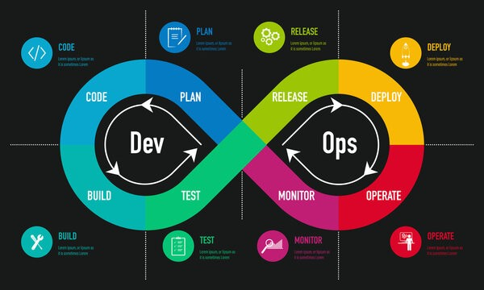

# Devops Porfolio

Welcome to my DevOps portfolio! This repository showcases my expertise in both Development and Operations, highlighting the tools and technologies I utilize to streamline software delivery pipelines.

I specialize in implementing continuous integration and continuous deployment (CI/CD) practices, infrastructure as code, and monitoring solutions. Below you'll find an overview of my technical stack and capabilities.

## What is DevOps?

Devops is collaboration, communication, and culture.  It represents the strategic fusion of Development and Operations practices, bridging traditional gaps between software creation and system maintenance. This marriage of disciplines eliminates silos, fostering seamless collaboration between teams that historically operated independently.

At its core, DevOps combines:
- Development practices focused on building and testing software
- Operations practices ensuring reliable deployment and maintenance
- Shared responsibility for the entire software lifecycle
- Automated processes that streamline delivery
- Cultural transformation that promotes unity and efficiency

This integration enables faster delivery, improved reliability, and better business outcomes through continuous collaboration and feedback.

## Defining "SDLC"

The SDLC, Software Delivery Lifecycle, represents the complete loop a team moves through to build and iterate on software. It encompasses the following steps:

1. Requirements gathering - going on the ground level and diving into your customers needs and designing solutions to solve their problems. This is usually handled by team members in product and sales roles, but may also be performed by engineering consultants.
2. Building, testing, and iterating on the solution to develop an MVP product. This will be done by software engineers, in partnership with architecture, devops, and data administrators.
3. Deploying the solution to cloud test environments. Accountabilities around this vary from shop to shop, but typically its a collaborative effort led by devops in conjunction with developers.
4. QA and demo. The QA team will run test suites and manual smoke tests as necessary to verify that requirements have been achieved. In some shops, there is no dedicated QA team, and QA is performed by the developers who built the feature. Product/sales may wish to test features themselves before final release.
5. Production deploy. Once the feature has been rubber stamped by QA and product, the feature can go out to the production environment. The pipelines and automations built to support this are typically built by the devops team, but in smaller shops may be built by the developers themselves.
6. Perhaps the most crucial step, this final step is for monitoring, feedback, and iteration. Invariably, engineers don't get it right the first time, because codifying an abstract use case into a script a computer can run is challenging. 

It's essential to have a pipeline that gathers feedback and feeds it back it the begining of the SDLC, so software can be improved upon. This is agile. 

Devops can and ideally should ecompass this entire process. The role often starts with pipelines around continuous integration and delivery, but the role can offer much more to a shop in order to improve the software development experience in general.

## Devops Contiuum

The DevOps Continuum represents a seamless, cyclical process that unifies software delivery and operations. Through this continuous flow, development and operations activities merge into a natural feedback loop that propels ongoing improvement. By embracing this iterative approach, organizations achieve quicker feature deployments while fostering stronger team collaboration. The continuum naturally reduces deployment-related risks and promotes an environment of constant learning and adaptation. Perhaps most importantly, this methodology leads to more reliable systems that better serve business needs.

### Development

The Development phase is where ideas transform into reality through a structured process of software creation. It begins with careful requirements gathering and analysis to understand the project needs. Teams then focus on system design and architecture planning to create a solid foundation. Developers write clean, maintainable code while implementing features and functionality according to specifications. Throughout this phase, version control systems track changes while code reviews ensure quality. Engineers conduct local testing and debugging to catch issues early, all while maintaining proper documentation and code comments for future reference.

- **Plan**: 
- **Code**: Development, Programming, POC
- **Build**: Docker, Jenkins, GitHub Actions, Ephemeral environments
- **Test**: JUnit, Selenium, smoke testing, pen testing, load testing, APM

### Operations

The Operations phase focuses on the reliable delivery and maintenance of software systems in production environments. This critical stage ensures applications run efficiently, securely, and at scale. Operations teams manage infrastructure, handle deployments, monitor system health, and respond to incidents. They implement automation to reduce manual tasks and human error, while maintaining high availability and performance. Through careful capacity planning and proactive maintenance, operations teams keep systems running smoothly while continuously optimizing for better reliability and cost efficiency.

- **Release**: Git, GitHub, GitLab, Continuous integration
- **Deploy**: Jenkins, Github Actions, Ansible, Terraform, Helm
- **Observe**: Monitoring and Operations, Support, Triage, Nagios, Prometheus, Grafana, ELK Stack, Incident Capture and Response, SRE, SLAs/SLOs/SLIs

## Why Devops?

DevOps is more than just a set of practices - it's a transformative approach that brings significant business value. By breaking down traditional silos between development and operations teams, organizations can achieve:

- Speed: Accelerate software delivery and reduce time-to-market.
- Operation: Improve system reliability, security, and scalability.
- Foster a culture of collaboration, innovation, and shared ownership.
- Enhance customer satisfaction through faster, more frequent updates and improvements.
- Improve cost management of infrastructure. 

## Greenfield Development

Greenfield development represents the exciting opportunity to build systems from scratch, free from legacy constraints. This blank-canvas approach allows teams to implement modern DevOps practices from day one, establishing robust foundations for future growth.

### Why DevOps is Critical for Greenfield Projects

- **Architecture Flexibility**: Start with cloud-native and containerized approaches
- **Infrastructure as Code**: Establish automated provisioning from the beginning
- **CI/CD Pipeline First**: Build automated testing and deployment workflows early
- **Monitoring by Design**: Implement observability patterns from the start
- **Security Integration**: Embed security practices throughout the development lifecycle

By incorporating DevOps principles from inception, greenfield projects can avoid technical debt while maintaining the agility needed for rapid iteration and scaling.

## I wish I had

In each section, I go over features and components to the devops process I hope I have on any project I'm on. This is built from real experience, taking into account times projects ran smoothly and times projects had some hiccups, to distill down what I believe are the core pieces a shop should focus on when building out and improving their devops solutions.